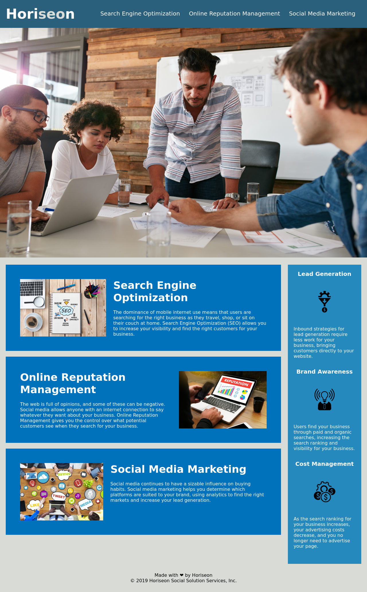

# 01-html-css-git-homework-demo

## Task


I was tasked to refactor an existing webpage to meet a web accessibility standard. This is to ensure that people with disabilities can access a website using assistive technologies. In particular, I was provided with the following user story and acceptance criteria.

### User Story

```
AS A marketing agency
I WANT a codebase that follows accessibility standards
SO THAT our own site is optimized for search engines
```

### Acceptance Criteria

```
GIVEN a webpage meets accessibility standards
WHEN I view the source code
THEN I find semantic HTML elements
WHEN I view the structure of the HTML elements
THEN I find that the elements follow a logical structure independent of styling and positioning
WHEN I view the image elements
THEN I find accessible alt attributes
WHEN I view the heading attributes
THEN they fall in sequential order
WHEN I view the title element
THEN I find a concise, descriptive title
```

### Preview

The end product should resemble the mock-up provided below:




## Table of Contents (Optional)

If your README is long, add a table of contents to make it easy for users to find what they need.
- [Installation](#installation)
- [Usage](#usage)

## Installation
What are the steps required to install your project? Provide a step-by-step description of how to get the development environment running.

## Usage
Provide instructions and examples for use. Include screenshots as needed.
To add a screenshot, create an `assets/images` folder in your repository and upload your screenshot to it. Then, using the relative filepath, add it to your README using the following syntax:
    
    ```md
    
    ```
